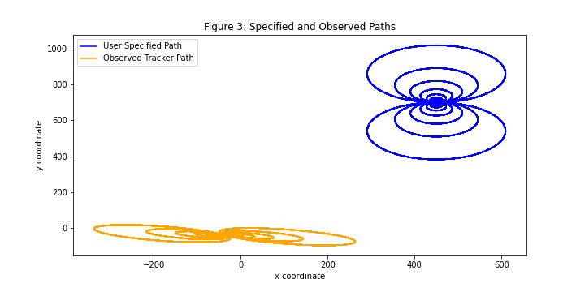
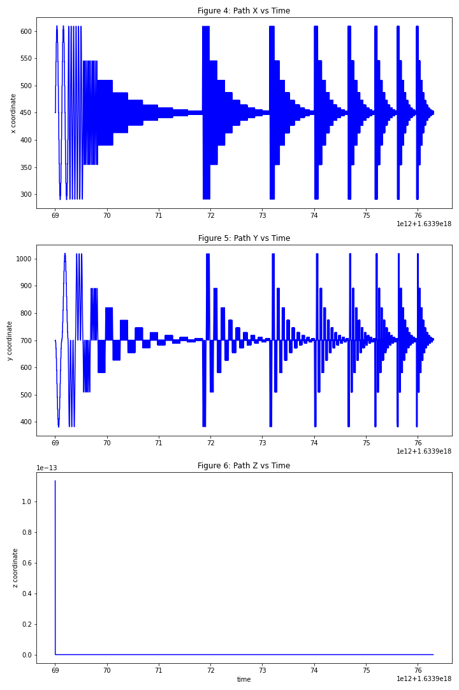
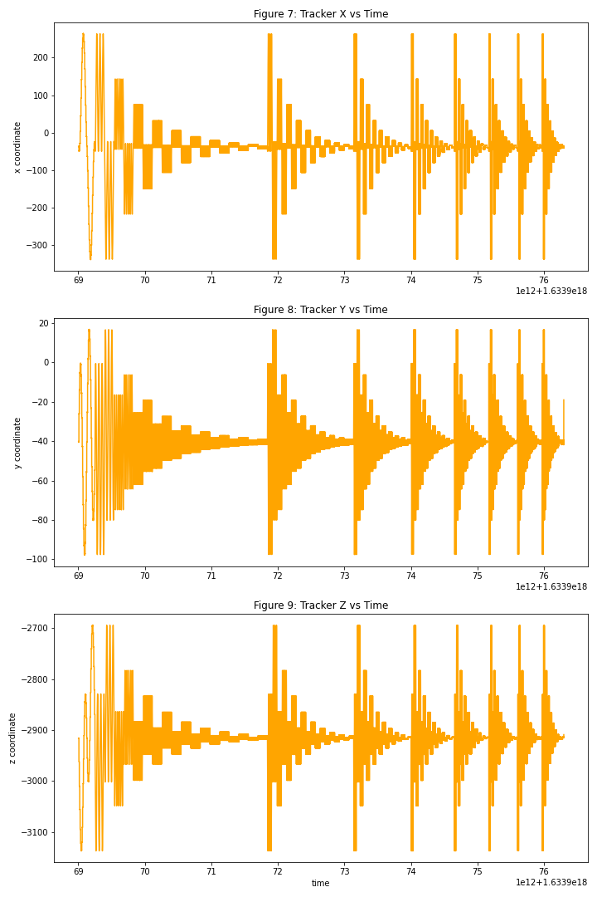
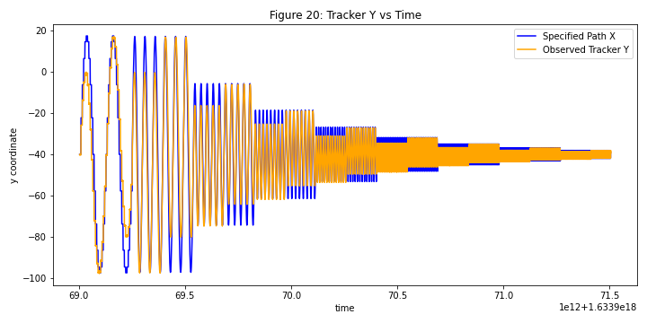
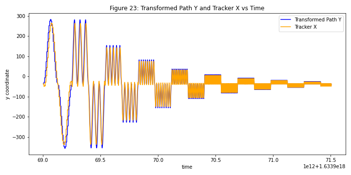
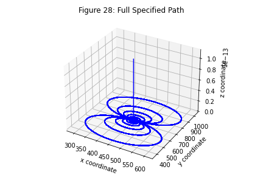
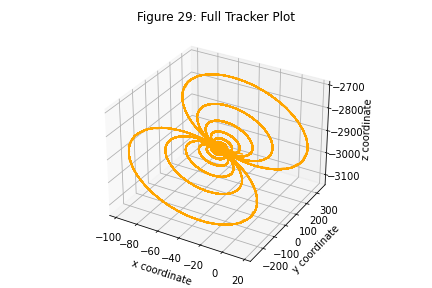
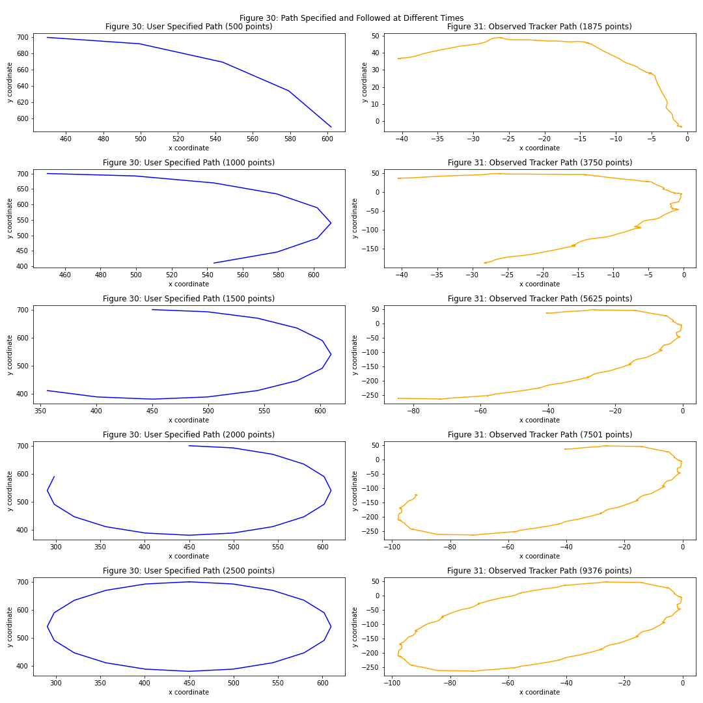

# Path Analysis Homework
___
## Adam Gibbs
## 31 March 2022
___
### Preface
This report will be used to document the summary of findings while the full report will be documented in analysis.ipynb. All insights, observations, and figures displayed in this report are also in analysis.ipynb.

### Observations 
The tracked path given in tracker.csv shows a clear transformation and distortion from the desired path given in path.csv, but the shape is still clear and noticeable despite the distortions. The following figure shows the two different paths where the blue loops show the desired path and the orange loops show the path the robotic arm actually followed.

To gain insights into why this distortion occured we first see how each coordinate, in both the desired path and tracker path, change with respect to time. The following two plots show how the different paths change over time.

 

 

Here, we notice the first major difference which is that the tracker path followed a specific pattern in the $z$ dimension that is not specified in the desired path at all. Further, it can be seen that the $x$ coordinates of the desired path more closely align with the $y$ coordinates of the tracker and the $y$ coordinates of the desired path more closely align with the $x$ coordinates of the tracker. These similarities become even more apparent when minor transformations are performed to shift and scale the desired path to match the axis that the tracker is plotted on. The following two figures show these similarities.

 

These plots show us that it appears that the $x$ and $y$ coordinates got swapped between the desired path and the tracker path, but there are still some discrepancies between the desired path and tracker path which become evident when they are overlapped on one plot. In particular, the regular shifting of amplitude in the tracker path for segments of time is rather peculiar to see on the $xy$ plane. Since this is an interesting observation but little can be gained from it, we can also look to the presence of patterns in the $z$ coordinate of the tracker path and decide to explore what the paths look like in three dimensions. So, we plotted the desired path and tracker path in 3D. The plots came out are presented below.

 

In the 3D plot of the desired path we can again see multiple loops in the $xy$ plane as stated in the intial README.md file given about the logs. However, and surprisingly, the loops appear undistorted in the 3D plot of the tracker path but projected off the $xy$ plane and into three dimensions. We did not try and find exact projection, but visually we can see the loops in this plot. 

After seeing this, we wondering why and how these points have been projected into 3D. To gain a little insight to this, we saw how the loops in the desired path and the tracker path developed over time to see if there were any mechanical hiccups "visible" in the logs that could cause something like this. The following plots show the progression of the desired path and tracker path after different amounts of time in 2D. The 3D version of these plots can be found in the analysis.ipynb notebook.

 

Here we can see corresponding parts of the loops are completed after similar amounts of time suggesting the mechanical arm followed the points it was told to go to well and thus, the error lies in the points it was ultimately told to go to. Also, it should be noted that the number of points for the desired path and tracker path are different on the plots because the optical tracker recorded the location of the robotic arm at a rate about 3.75 times the rate that which points where specified in the desired path.

All these observations, and more, were made from the raw log files and from these we were able to gain some insights into what might be causing the errors and what we think is not causing the errors. These insights are listed in the next section.

### Insights
Given the raw log files from the specified path in path.csv and the observed path in tracker.csv we can draw some insights into why the robotic arm is not working the way it should, but more investigation would definitely be needed. There clearly are errors in the tracker path and we have the following insights that could help lead toward the root cause.

- The general form of the loops in the $xy$ plane are preserved in the tracker path, but with a significant transform that distorts the loops. This suggests the error is in how the specified path is translated into machine readable points.
- In some of the coordinate vs time plots, especially the zoomed in ones, the peaks of the plots appear to get cut off often. This could be an issue in the robotic arms ability to change direction so it has to plateau some of the peaks. It could also be another visual result of trying to interpret the 3D projection in 2D plots.
- The form of the loops in the tracker path appears to be perfectly preserved in three dimensions. This suggests the loops specified in path.csv in the $xy$ plane are projected into 3D
    - This is supported not only by the 3D plots but also in the $y$ vs time and $z$ vs time plots of the tracker path which both exhibit similar patterns to that seen in path $x$ but not exactly the same. Also the presence of $z$ coordinate values other than 0 at all supports this.
- Although the observed track appears shaky and imprecise (could be the robotic arm itself or limitations of the optical tracker), the robotic arm hits corresponding points on the loops at the correct times specified in path.csv which suggests the error does not come from an inability to mechanically follow certain points or patterns of points.
- **Overall, it follows from all the observations that the errors arise in either code translation from specified points to machine readable points or there is some form of calibration error in the mechanics of the robotic arm that causes the machine to follow a path different than the one it believes it is following.** 
- **The errors also appear to be general and not restricted to any specific points or patterns of points. All points appear to be projected accurately into 3D, preserving its true form there but not in the $xy$ plane where it is desired.**
